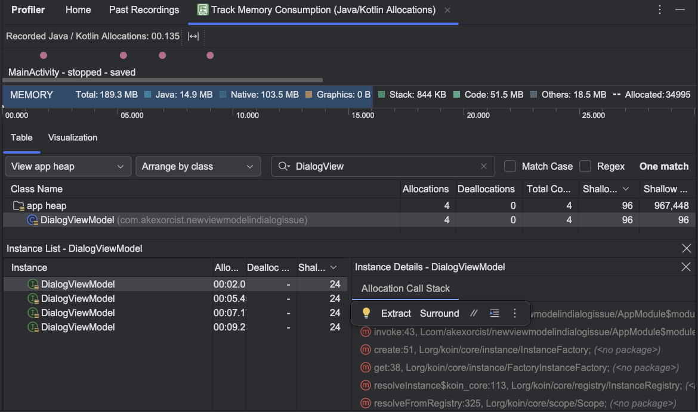

# New instance of ViewModel for Compose-based Dialog Issue
---
An example project for the problem of creating a new instance of a ViewModel for use in a
Compose-based Dialog. See more issue details on Koin at [InsertKoinIO/koin#1477](https://github.com/InsertKoinIO/koin/issues/1477) 

## Problem
Using a unique key to create a ViewModel with Koin will create a new instance of a ViewModel, but the ViewModel of a dismissed dialog doesn't get destroyed from memory allocation. This can be a cause of an out-of-memory issue.

